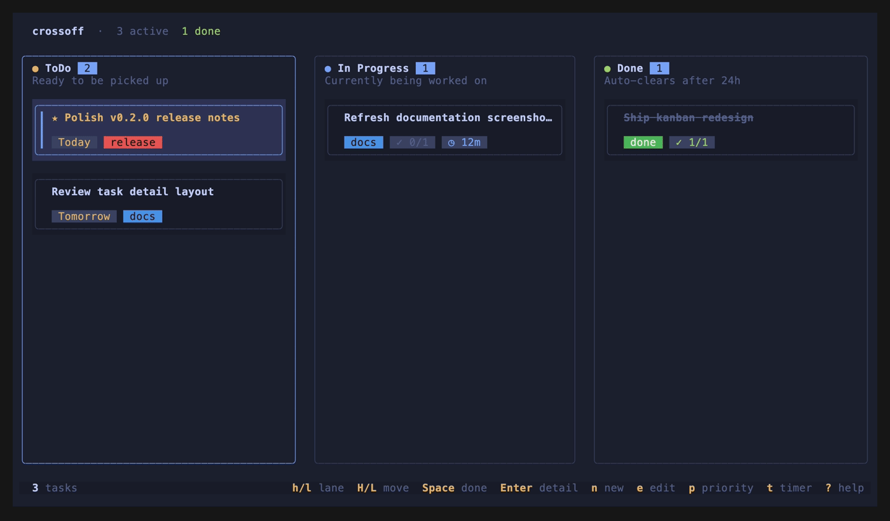

# crossoff

A fast, keyboard-driven terminal task manager built in Rust.



---

## Features

- Projects with a pinned Inbox, tasks sorted by due date
- Multi-line descriptions, labels, checklists, due dates
- Scrollable detail pane, fuzzy search with highlighted matches
- Pin tasks to top, eight built-in themes
- Completed tasks auto-clean after one hour

---

## Install

**Pre-built binaries** — download for your platform from the [Releases](../../releases) page, then:

```sh
chmod +x crossoff-* && mv crossoff-* /usr/local/bin/crossoff
```

**From source:**

```sh
cargo install --git https://github.com/marschall-sh/crossoff
```

---

## Uninstall

```sh
cargo uninstall crossoff
```

If installed manually, delete the binary and optionally remove your data:

```sh
rm /usr/local/bin/crossoff
rm -rf ~/.config/crossoff ~/.local/share/crossoff
```

---

## Keybinds

| Key | Action |
|-----|--------|
| `↑` / `↓` or `j` / `k` | Navigate |
| `Tab` / `Shift+Tab` | Cycle panes |
| `Enter` / `Space` | Toggle task done |
| `n` / `e` / `d` | New / edit / delete |
| `p` | Pin task to top |
| `/` | Fuzzy search |
| `Ctrl+S` | Save in any editor |
| `?` | Help |
| `q` | Quit |

---

## Configuration

`~/.config/crossoff/config.toml` (XDG respected):

```toml
theme = "tokyo-night"
# Optional custom storage path
# Can be a directory or a full .json file path
# data_dir = "/absolute/path/to/crossoff-data"
# data_dir = "/absolute/path/to/crossoff-data/data.json"
```

Available themes: `tokyo-night` · `catppuccin-mocha` · `catppuccin-latte` · `dracula` · `gruvbox-dark` · `nord` · `solarized-light` · `rose-pine-dawn`

Storage behavior:
- Default data file: `~/.local/share/crossoff/data.json` (or `XDG_DATA_HOME/crossoff/data.json`)
- Atomic saves via `data.json.tmp` + rename
- Automatic backup file: `data.json.bak` (used as fallback on load if main file is unreadable)

---

## License

MIT
